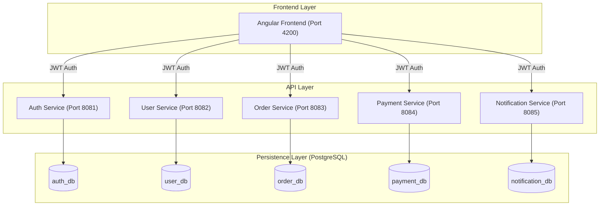

# Microservice Ecosystem: DevOps Documentation

This repository contains a container-ready, microservice-based ecosystem comprising five Spring Boot backend services and an Angular standalone frontend.

## System Architecture



## Service Catalog

| Service | Port | Database | Primary Responsibility |
| :--- | :--- | :--- | :--- |
| **Auth** | 8081 | `auth_db` | Identity Management, JWT Generation, BCrypt Hashing |
| **User** | 8082 | `user_db` | User Profiles, Dashboard Context |
| **Order** | 8083 | `order_db` | Transactional Orders, Status Management |
| **Payment**| 8084 | `payment_db` | simulated Payment Processing |
| **Notification**| 8085| `notification_db`| Event Logging, Notification Dispatch |

## Infrastructure Requirements

### PostgreSQL Setup
The application expects a PostgreSQL instance running on `localhost:5432`.
- **User**: `microuser`
- **Password**: `micropass`
- **Databases required**: `auth_db`, `user_db`, `order_db`, `payment_db`, `notification_db`.

## Security Implementation

### 1. Authentication (JWT)
The system uses stateless JWT authentication.
- **Auth Service**: Generates tokens containing `userId`, `email`, and `name`.
- **Microservices**: Validate tokens using a shared secret key and extract identity claims.
- **Frontend**: Uses an `HttpInterceptor` to automatically attach the `Authorization: Bearer <token>` header to all outgoing requests.

### 2. Password Hashing
All user passwords in the `users` table are hashed using **BCrypt** with a salt (standard industry practice). Plain-text passwords are never stored.

### 3. CORS
Backend services are configured to allow cross-origin requests from `http://localhost:4200`.

## Operational Commands

### Automated Startup
To launch the entire ecosystem (checking DBs, starting all 6 components):
```bash
./start-all.sh
```

### Manual Service Control
Individual services can be managed using the Maven Wrapper (`./mvnw`) within their respective directories:
```bash
# Example: Restarting Order Service
cd order-service
./mvnw spring-boot:run
```

### Stopping a Specific Service
To stop a service by its port (e.g., port 8083):
```bash
lsof -t -i :8083 | xargs kill -9
```

### Monitoring Logs
Logs are directed to a centralized `logs/` directory:
```bash
tail -f logs/startup.log
tail -f logs/order-service.log
```

## DevOps Notes
- **Scalability**: Each service is stateless and can be scaled horizontally.
- **Data Isolation**: Each microservice strictly owns its own database schema.
- **Integration**: The frontend uses `localStorage` for session persistence.
