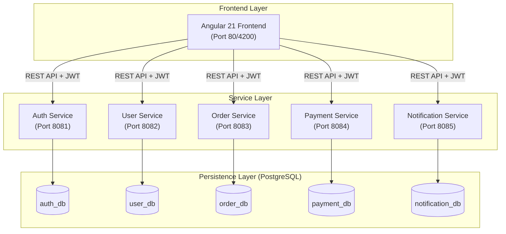

# Microservice Application Ecosystem

A modern, production-ready microservice architecture built with **Spring Boot 4**, **Angular 21**, and **PostgreSQL**. This project demonstrates a complete end-to-end ecosystem with centralized authentication, service isolation, and automated containerized deployment.

---

## 🏗️ System Architecture

The application follows a distributed architecture where each service owns its domain and database, adhering to the **Database-per-Service** pattern.



---

## 🛠️ Technology Stack

| Layer | Technologies |
| :--- | :--- |
| **Backend** | Java 17, Spring Boot 4.0.2, Spring Security, Spring Data JPA, Hibernate |
| **Frontend** | Angular 21, TypeScript, Vanilla CSS, RXJS |
| **Database** | PostgreSQL 15 |
| **Security** | JSON Web Tokens (JWT), BCrypt Password Hashing |
| **DevOps** | Docker, Docker Compose, Nginx, Multi-stage Builds |
| **Build Tools** | Maven, NPM |

---

## 📦 Service Breakdown

### 1. Auth Service (Identity Provider)
- **Role**: Manages user accounts and issues security tokens.
- **Key Features**:
    - Patient Signup/Login with BCrypt password encryption.
    - JWT Generation containing user identity (`userId`, `email`, `name`).
    - CORS configuration for frontend integration.
- **Key Files**: `JwtUtil.java`, `AuthService.java`, `AuthController.java`.

### 2. User Service (Profile Management)
- **Role**: Manages user-specific metadata and dashboard context.
- **Key Features**:
    - Extracts identity from JWT via `JwtAuthFilter`.
    - Auto-creates default profiles on first login.
- **Key Files**: `JwtAuthFilter.java`, `UserController.java`, `UserProfile.java`.

### 3. Order Service (Transactions)
- **Role**: Core business logic for creating and tracking orders.
- **Key Features**: RESTful CRUD operations for order management.
- **Key Files**: `OrderController.java`, `OrderRepository.java`.

### 4. Payment Service (Billing)
- **Role**: Handles simulated payment transactions.
- **Key Features**: Integrates with the order flow to record payment statuses.
- **Key Files**: `PaymentController.java`, `Payment.java`.

### 5. Notification Service (Communication)
- **Role**: Centralized hub for system notifications.
- **Key Features**:
    - **Real Email Integration**: Uses `spring-boot-starter-mail` to attempt actual email delivery.
    - Audit logging of all notification events.
- **Key Files**: `EmailService.java`, `NotificationController.java`.

---

## 🔐 Technical Implementation Patterns

### **Stateless Authentication (JWT)**
The system uses a decentralized security model. The **Auth Service** generates a signed token. All other microservices contain a `JwtAuthFilter` that validates the token locally using a shared secret, preventing the need for frequent round-trips to the Auth service.

### **Database Isolation**
Each service connects to its own dedicated PostgreSQL database. In a Docker environment, the `init-db.sql` script ensures all 5 databases and the application user are created automatically upon the first startup.

### **Optimized Docker Images**
All Dockerfiles use **multi-stage builds**:
1.  **Stage 1 (Build)**: Compiles code and generates JAR/Build artifacts (Maven/Node).
2.  **Stage 2 (Run)**: Copies only the required artifacts into a minimal JRE/Nginx image, reducing the attack surface and image size.

---

## 🚀 Getting Started

### Option A: Docker (Recommended)
Launch the entire system (Frontend + 5 Backends + Database) with one command:
```bash
docker compose up --build
```
- **Web App**: http://localhost
- **API Endpoints**: http://localhost:8081 through :8085

### Option B: Local Development
Ensure PostgreSQL is running on `5432` with user `microuser`, then run:
```bash
./start-all.sh
```

---

## 📈 Monitoring & Logs
- **Docker Logs**: `docker compose logs -f`
- **Local Logs**: Check the `logs/` directory in the project root.
- **Health Checks**: Each backend service exposes health endpoints (e.g., `GET /auth/health`).

---

## 📝 Configuration & Environment Variables
Key configurations are managed via `application.properties` or environment variables in `docker-compose.yml`:
- `SPRING_DATASOURCE_URL`: Database connection string.
- `JWT_SECRET`: Secret key for signing tokens.
- `SPRING_MAIL_HOST`: SMTP server for notifications.
