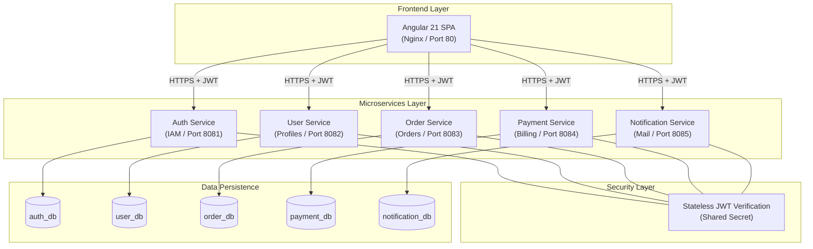
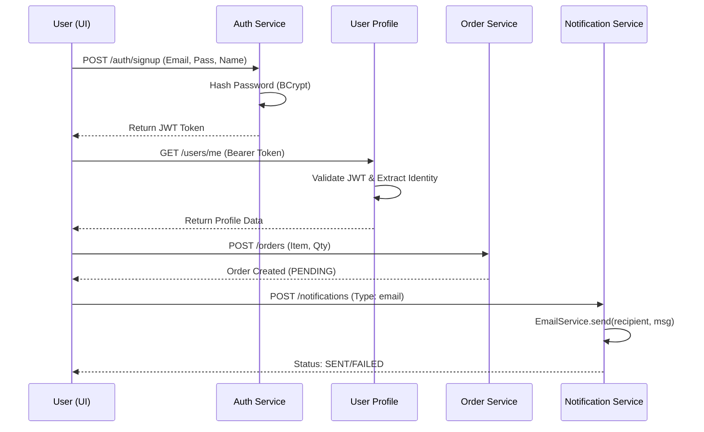

# 🏥 Microservice Application Ecosystem: Technical Manual

A high-performance, distributed ecosystem built with **Spring Boot 4**, **Angular 21**, and **PostgreSQL**. This documentation provides a 360-degree view of the system's architecture, data models, security protocols, and deployment strategies.

---

## 📑 Table of Contents
1. [System Architecture](#system-architecture)
2. [Communication Flow](#communication-flow)
3. [Service Deep-Dive](#service-deep-dive)
    - [Auth Service](#1-auth-service-port-8081)
    - [User Service](#2-user-service-port-8082)
    - [Order Service](#3-order-service-port-8083)
    - [Payment Service](#4-payment-service-port-8084)
    - [Notification Service](#5-notification-service-port-8085)
4. [Authentication & Security](#authentication--security)
5. [Database Schemas](#database-schemas)
6. [Frontend Application](#frontend-application)
7. [Deployment & DevOps](#deployment--devops)
8. [Troubleshooting](#troubleshooting)

---

## 🏗️ System Architecture

The system utilizes a **Microservices Architecture** with a **Shared Identity Provider** and **Database-per-Service** isolation.



---

## � Communication Flow

Below is the standard sequence for a user journey from **Signup** to **Order Notification**.



---

## 📦 Service Deep-Dive

### 1. Auth Service (Port 8081)
The Identity Provider (IdP) for the entire system.
- **Endpoints**:
    - `POST /auth/signup`: Creates a new user.
    - `POST /auth/login`: Validates credentials and returns a JWT.
- **Security Logic**:
    - Uses `BCryptPasswordEncoder` for cryptographic hashing.
    - Generates HS256 JWTs with `userId`, `email`, and `userDisplayName` claims.
- **Table**: `users` (id, email, password, name, created_at).

### 2. User Service (Port 8082)
Manages the extended user profile and dashboard context.
- **Endpoints**:
    - `GET /users/me`: Fetches the current user's profile.
    - `PUT /users/update`: Updates profile details (phone, address).
- **Core Feature**: The `JwtAuthFilter` extracts security context from every request, meaning the service does not store passwords—it only trust verified JWTs.
- **Table**: `user_profiles` (id, userId, email, name, phone, address).

### 3. Order Service (Port 8083)
Coordinates transactional state for items.
- **Endpoints**:
    - `GET /orders`: List user's orders.
    - `POST /orders`: Create new order.
- **Logic**: Implements a simple transactional model where orders transition from `PENDING` to `COMPLETED`.
- **Table**: `orders` (id, userId, item, quantity, total_price, status, created_at).

### 4. Payment Service (Port 8084)
Records and processes simulated billing cycles.
- **Endpoints**:
    - `POST /payments`: Record a payment event.
    - `GET /payments/{orderId}`: Query payment history for an order.
- **Logic**: Supports multiple methods (Credit Card, PayPal).
- **Table**: `payments` (id, userId, orderId, amount, status, method, created_at).

### 5. Notification Service (Port 8085)
The communication bridge of the ecosystem.
- **Endpoints**:
    - `POST /notifications`: Triggers a message dispatch.
- **Intelligence**: Integrated with **Spring Boot Starter Mail**. It reads SMTP properties and attempts to connect to a real mail server (e.g., Gmail, Outlook) to deliver messages.
- **Table**: `notifications` (id, userId, type, recipient, message, status).

---

## 🔐 Authentication & Security

### **The JWT Backbone**
The system uses **Stateful Creation but Stateless Validation**:
1.  **Creation**: Auth Service signs the token using a secret key.
2.  **Propagation**: The Frontend stores the token in `localStorage`.
3.  **Validation**: Every microservice owns a copy of the **Secret Key**. When a request arrives, the service re-verifies the digital signature locally. If valid, the user's ID is extracted and put into the `SecurityContext`.

### **Intercepting Requests**
The Frontend uses an `AuthInterceptor` (Angular) to intercept every HTTP call and inject the `Authorization: Bearer <token>` header, ensuring the user never has to re-login within a session.

---

## 🗄️ Database Schemas

Each database is managed by the service's JPA/Hibernate layer.

| Service | Table | Primary Key | Critical Fields |
| :--- | :--- | :--- | :--- |
| **Auth** | `users` | `Long id` | `email` (unique), `password` (hashed) |
| **User** | `user_profiles`| `Long id` | `userId` (FK match), `email` |
| **Order** | `orders` | `Long id` | `status`, `userId` |
| **Payment**| `payments` | `Long id` | `orderId`, `status` |
| **Note** | `notifications`| `Long id` | `recipient`, `status` |

---

## 🌐 Frontend Application

Built with **Angular 21**, the frontend uses modern **standalone components** (no NgModules).

- **Routing**: Optimized using provideRouter with guards.
- **Reactive State**: Uses `HttpClient` with Observables to manage real-time UI updates.
- **Components**:
    - `LoginComponent`: Handles authentication.
    - `SignupComponent`: Handles registration.
    - `DashboardComponent`: A central control center that talks to all 5 services simultaneously.

---

## 🚀 Deployment & DevOps

### **Docker Orchestration (Highly Recommended)**
The ecosystem is optimized for Docker. Our `docker-compose.yml` includes:
- **Database Auto-Init**: Uses `init-db.sql` to build all 5 databases on first run.
- **HealthChecks**: The microservices will "wait" for the Database to be healthy before starting.
- **Nginx**: Static frontend files are served via Nginx for lightning-fast performance.

**Run All:**
```bash
docker compose up --build
```

### **Multi-Stage Build Process**
To keep things lightweight, we use a 2-stage Docker process:
1.  **Build Stage**: Maven/Node environment to compile code.
2.  **Runtime Stage**: Minimalist Alpine Linux with only JRE 17 or Nginx installed. (Size reduction: ~70%).

---

## ☁️ VM Deployment
For cloud deployment (AWS/GCP/Azure):
1.  Clone the repo on your VM.
2.  Ensure ports `80` (Frontend) and `8081-8085` (APIs) are open in your security groups.
3.  Run `docker compose up -d`.

---

## 🛠️ Troubleshooting
- **Database Connection Refused**: Check if the `postgres` container is healthy using `docker compose ps`.
- **401 Unauthorized**: Ensure your JWT token hasn't expired (default: 24h).
- **Email Fails**: Update `application.properties` in `notification-service` with valid SMTP credentials.
